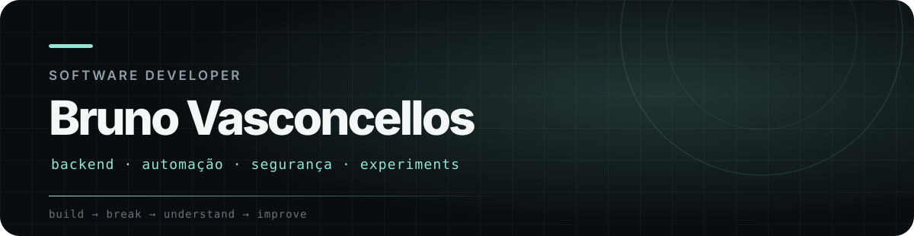
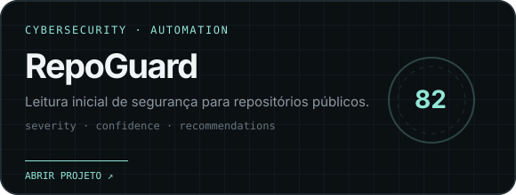
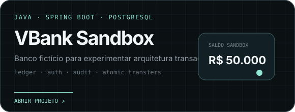

  

  
  
  

 

<table>
<tr>
<td width="62%" valign="top">

<h3>Sobre mim.</h3>

Não busco ser bom em tudo. Gosto de <b>explorar</b>, entender como as coisas funcionam e aprender enquanto construo.

Posso começar em um site simples e terminar mexendo com uma API, um bot, visão computacional, um app ou alguma ideia dentro de um jogo. <b>Backend, segurança e automação</b> são meus focos principais, mas não minhas fronteiras.

<blockquote>aprender → construir → quebrar → entender → melhorar</blockquote>

</td>
<td width="38%" valign="top">

<h3>Agora.</h3>

<pre>
building   software & APIs
exploring  cloud & security
playing    games & mobile
studying   ADS
</pre>

Curiosidade continua sendo a ferramenta que eu mais uso.

</td>
</tr>
</table>

 

## Meu deck de ferramentas.

  

  Java · Python · TypeScript · Spring Boot · PostgreSQL · Astro · React · Docker · Godot · Flutter

 

## O que eu andei construindo.

<table>
<tr>
<td width="50%" valign="top">
  
  
Código fechado · análise de segurança e automação.

</td>
<td width="50%" valign="top">
  
  
<a href="https://github.com/BrunoAV1/VBank">código ↗</a> · Java 21 + Spring Boot + PostgreSQL.

</td>
</tr>
</table>

 

### Quer ver o resto?

Nem tudo precisa caber num README.

**[brunovasconcellos.com.br ↗](https://brunovasconcellos.com.br)**

 

Bruno A. Vasconcellos · 2026

