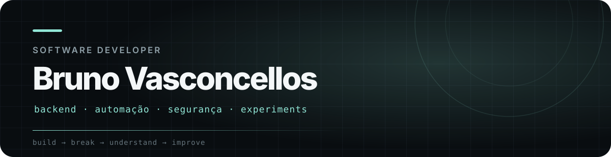
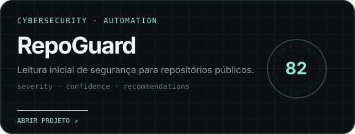
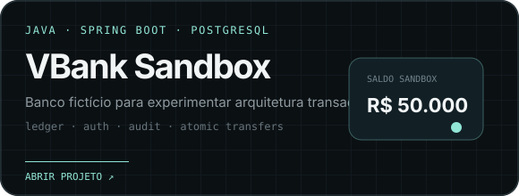

  

  
  
  

 

<table>
  <tr>
    <td width="62%" valign="top">
      <h3>Construindo, testando, aprendendo.</h3>
      
Desenvolvo aplicações <b>fullstack</b>, APIs e ferramentas próprias. Gosto de explorar um problema até entender tanto a implementação quanto a experiência de quem vai usar o software.

      
Entre projetos web, automação e experimentos, venho aprofundando meu interesse por <b>segurança de aplicações</b> e arquitetura de sistemas.

      
Construir → testar → entender → melhorar.

    </td>
    <td width="38%" valign="top">
      <h3>No momento.</h3>
      <pre>building   web apps & APIs
exploring  app security
learning   cloud & tooling
studying   ADS</pre>
      
Análise e Desenvolvimento de Sistemas · UNIASSELVI

    </td>
  </tr>
</table>

 

## Ferramentas que fazem parte do caminho.

  

Backend · Frontend · APIs · Segurança de aplicações · Experimentos

 

## Projetos em destaque.

<table>
  <tr>
    <td width="50%" valign="top">
      
      
Segurança de repositórios públicos · análise automatizada. <a href="https://repoguard-codigo.vercel.app/">demo ↗</a> · <a href="https://github.com/BrunoAV1/RepoGuard">apresentação ↗</a>

    </td>
    <td width="50%" valign="top">
      
      
Java 21 · Spring Boot · React · PostgreSQL. <a href="https://v-bank-three.vercel.app/">demo ↗</a> · <a href="https://github.com/BrunoAV1/VBank">código ↗</a>

    </td>
  </tr>
  <tr>
    <td width="50%" valign="top">
      
      
Clima e qualidade do ar · dados meteorológicos. <a href="https://ecomonitor-br.vercel.app/">demo ↗</a> · <a href="https://github.com/BrunoAV1/ecomonitor-br">código ↗</a>

    </td>
    <td width="50%" valign="top">
      
      
Visão computacional · laboratório experimental. <a href="https://dms-study-lab-codigo.vercel.app/">demo ↗</a> · <a href="https://github.com/BrunoAV1/DMS-Study-Lab">documentação ↗</a>

    </td>
  </tr>
</table>

O RepoGuard é uma ferramenta de apoio, não uma auditoria. O VBank opera apenas com valores fictícios. O DMS Study Lab é experimental e tem código de implementação privado.

 

  <h3>Mais que um README.</h3>
  
Outros projetos, artigos e experimentos ficam no portfólio.

  
<a href="https://www.brunovasconcellos.com.br/"><b>brunovasconcellos.com.br ↗</b></a>

  Bruno A. Vasconcellos · 2026

